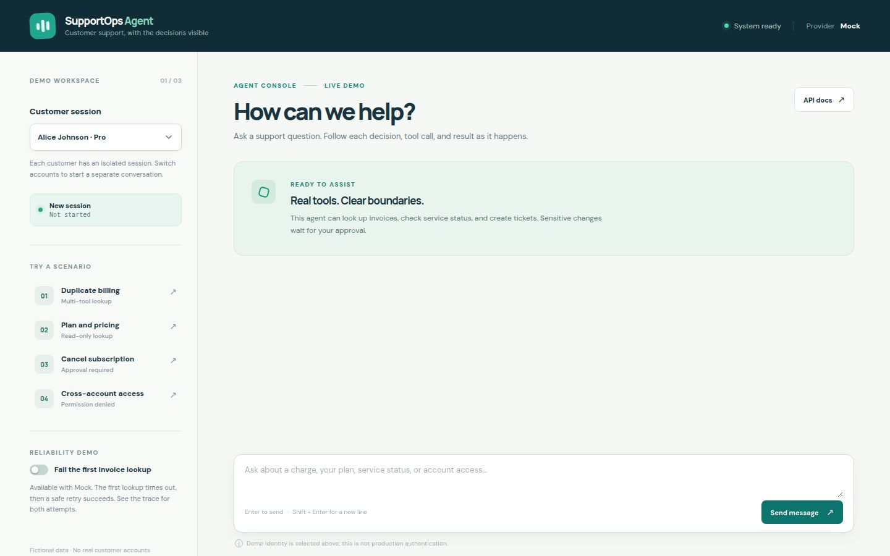

# SupportOps Agent

SupportOps Agent is a **provider-agnostic Python AI support agent** that uses tool calling, FastAPI, structured outputs, permissions, bounded retries, and mock business systems so it can be safely tested with or without real LLM APIs.

It chooses typed business tools, checks their results, and returns a structured answer. A plain HTML/CSS/JavaScript console shows the tools used, trace events, and approval requests. The default Mock provider runs completely offline with seeded fictional data. This is a portfolio demonstration of agent architecture and safety boundaries, **not a production identity or billing system**.

## What you can try

Select Alice, Bob, or Charlie in the UI, then ask:

- “Why was I charged twice?” — customer lookup, invoice lookup, and a billing ticket.
- “What subscription am I on?” — customer and plan lookup.
- “Is the service currently down?” — service status lookup.
- “Create a ticket because I can't log in.” — creates an access ticket.
- “Reset my password.”, “Refund my charge.”, or “Cancel my subscription.” — explicit approval before any high-impact write.
- As Alice, “Show me Bob's invoices.” — denied in Python **before** another customer's data is retrieved.

With Mock selected, enable **Fail the first invoice lookup** and ask a billing question. The trace shows the failed attempt, exponential-backoff retry, and successful result. The API also accepts `simulate_failure` values `invoice_timeout_always`, `invoice_rate_limit_once`, `invoice_service_unavailable_once`, and `invoice_database_error_once` for other controlled failure paths. Failure injection is rejected for real providers.

## Architecture

```text
 Browser / HTTP client
       |
       v
 Plain HTML/CSS/JS console (served by FastAPI)
       |
       v
FastAPI  /api/chat  /api/confirm  /api/traces/{id}
       |
       +--> Session resolver (fixed fictional customer identity)
       |
       v
Bounded AgentEngine (max 8 decisions)
       |
       +--> LLMProvider protocol --> Mock | OpenAI | Anthropic
       |          native provider tool requests, structured final answer
       |
       +--> Registry: input schema + output schema + permission + approval rule
       |          |
       |          v
       |       Python ownership checks --> business tools --> SQLite
       |                                     reads: bounded retries
       |                                     writes: at most one attempt
       |
       +--> Agent Trace --> SQLite --> trace viewer
```

The model **never** receives a database handle. It can request one of ten named tools; the server checks the tool name, Pydantic arguments, the session's customer ownership, and the tool's permission metadata. Results are validated before they go back to the model. Write tools operate on the server-bound customer, not a model-provided customer ID. The engine stops after `MAX_AGENT_STEPS`.

The provider abstraction keeps vendor SDK calls out of the agent engine. `MockLLMProvider` uses deterministic rules for known scenarios; OpenAI and Anthropic adapters use their native tool-call mechanisms and parse a validated final JSON response. Switching providers changes configuration, not agent or tool code. A Gemini adapter could implement the same `LLMProvider.decide()` contract later.

### Approval and state

Ticket creation is a low-impact write and runs immediately. Password-reset requests, refunds, and cancellations are gated: the first chat request stores a validated, session-bound pending action and returns `confirmation_required` without executing it. Only `POST /api/confirm` with the matching session and trace ID can consume that pending action. Declining makes no change; approval consumes the action before one write attempt, so an uncertain failure is **not** blindly retried. A session remembers its customer, pending confirmation, and a small set of previous structured tool results; it does not replay a raw conversation into every tool.

`AgentTrace` stores observable events—selected tool, authorization decision, attempt, duration, retry, and outcome. It intentionally does **not** store or expose hidden chain-of-thought. Trace and customer read endpoints require the owning demo session ID.

## Quick start

Install Python 3.12+ and [uv](https://docs.astral.sh/uv/), then from the repository root:

```bash
uv sync --frozen
cp .env.example .env
uv run uvicorn app.main:app --reload
```

Open `http://127.0.0.1:8000/` for the console or `/docs` for FastAPI's generated API documentation. The fictional SQLite database is seeded automatically at startup. The default `LLM_PROVIDER=mock` needs no API key or network access after dependencies are installed.

Run the offline checks:

```bash
uv run pytest
uv run python -m evals.run
```

The Makefile also offers `make run`, `make seed`, `make test`, and `make eval`.

### OpenAI

Set `LLM_PROVIDER=openai` and `OPENAI_API_KEY` in your environment or in a local, uncommitted `.env`. Optionally set `MODEL_NAME` (default: `gpt-4o-mini`). Restart the app. The adapter fails at startup if the selected provider's key is missing; it does not silently switch to Mock.

### Anthropic

Set `LLM_PROVIDER=anthropic` and `ANTHROPIC_API_KEY` in your environment or local `.env`. Optionally set `MODEL_NAME` (default: `claude-3-5-haiku-latest`). Restart the app. This switch needs no agent code changes. Real-provider calls require the corresponding account and API access; the offline tests do not contact either provider.

Real-provider requests have a configurable `LLM_TIMEOUT_SECONDS` (30 seconds by default) and no hidden SDK retries; tool reads have their own bounded retry policy. Never commit API keys. The application deliberately uses `SUPPORTOPS_DATABASE_URL`, defaulting to SQLite, so an unrelated `DATABASE_URL` cannot redirect it to another database.

## API

| Method | Route | Purpose |
|---|---|---|
| `POST` | `/api/chat` | Start/continue a session and run the bounded agent loop |
| `POST` | `/api/confirm` | Approve or decline a session-bound pending action |
| `GET` | `/api/traces/{trace_id}?session_id=...` | Read observable events for the owning session |
| `GET` | `/api/customers/{customer_id}?session_id=...` | Read the owning demo customer's profile |
| `GET` | `/api/health` | Provider and health information |

Example offline request:

```bash
curl -s http://127.0.0.1:8000/api/chat \
  -H 'Content-Type: application/json' \
  -d '{"customer_email":"alice@example.test","message":"Why was I charged twice?"}'
```

Keep the returned `session_id` for later chats. A confirmation call sends the returned `session_id` and `trace_id` with `"confirm": true` or `false`.

## Tests and evaluations

`uv run pytest` checks the database and seeded data, API routes, provider selection, typed tool arguments/results, bounded loop, malformed responses, read retries and fallback, single-attempt writes, session isolation, approval, and cross-customer denial. It needs no credentials or internet access.

`uv run python -m evals.run` runs the end-to-end agent loop for scenarios in `evals/scenarios.json` using a fresh in-memory seeded SQLite database per scenario. It reports pass rate, required tool-selection accuracy, unauthorized actions, and confirmation violations. To try the same scenario runner with a configured external provider, pass `--provider openai` or `--provider anthropic`; the Mock results are deterministic, while external-provider answers may vary.

## Project map

```text
app/agent/       bounded loop and structured models
app/providers/   interchangeable Mock, OpenAI, and Anthropic adapters
app/tools/       typed customer, billing, ticket, and status tools + registry
app/services/    authorization, retry, tracing, and error boundaries
app/db/          SQLAlchemy models and session setup
app/main.py      FastAPI routes and static UI
static/          HTML, CSS, and JavaScript console
tests/           pytest API and boundary tests
evals/           scenarios and report runner
seed.py          idempotent fictional data seed
```

## Screenshots



## Known limitations

- Picking a sample email is **not authentication**. This demonstrates tool-layer authorization within a fixed test session, not identity verification. Never expose real customer data this way; integrate real auth and session handling first.
- SQLite and `create_all()` are appropriate for a single-instance demo, not a multi-worker production deployment or schema migration strategy.
- Password-reset requests are queued as local demo records; no email is sent. Refund and cancellation mutate only fictional SQLite records, not a payment provider.
- The real-provider adapters use native tool requests, but their live network behavior is not part of the offline test suite and depends on model/API compatibility.
- The Mock provider intentionally covers known demo scenarios rather than arbitrary natural-language conversation.

## Future improvements

Add real user authentication, Alembic migrations, audit retention controls, stronger idempotency for external writes, provider-specific integration tests, and an optional Gemini adapter. Those are deliberately outside this portfolio-sized demo.